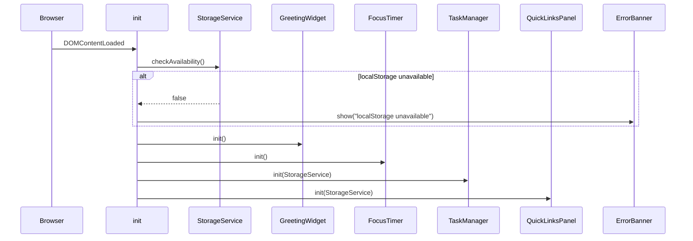
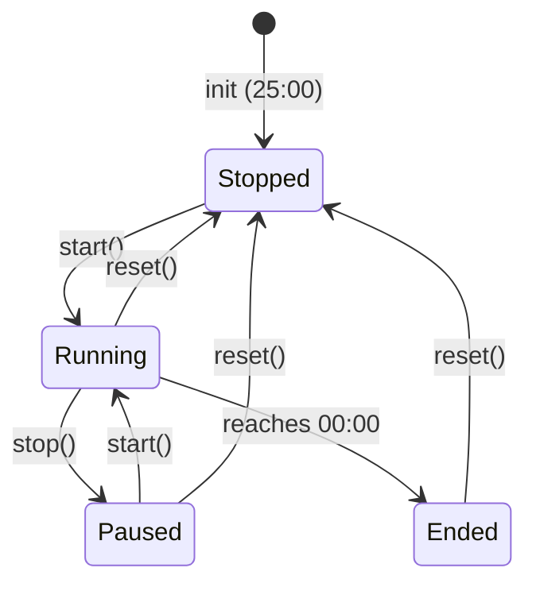

# Design Document — To-Do List Life Dashboard

## Overview

The To-Do List Life Dashboard is a zero-dependency, single-page web application delivered as three files: `index.html`, `css/style.css`, and `js/app.js`. It runs entirely in the browser — no build step, no server, no framework. Four independent widgets share the same page:

| Widget | Purpose |
|---|---|
| Greeting Widget | Live clock, date, and time-aware greeting |
| Focus Timer | 25-minute Pomodoro countdown |
| Task Manager | Full CRUD to-do list |
| Quick Links Panel | Saved URL shortcut buttons |

All mutable state is persisted to `localStorage` so the page is immediately usable on every subsequent load.

---

## Architecture

### Layered Module Structure

The single `js/app.js` file is organised into four logical layers, each expressed as a plain-object module using an IIFE or module-object pattern:

```
┌────────────────────────────────────────────────────┐
│                    app.js                          │
│                                                    │
│  ┌──────────────┐  ┌────────────────────────────┐  │
│  │  StorageService │  │  DOMUtils / ErrorBanner  │  │
│  └──────────────┘  └────────────────────────────┘  │
│                                                    │
│  ┌──────────────┐  ┌────────────────────────────┐  │
│  │GreetingWidget│  │      FocusTimer            │  │
│  └──────────────┘  └────────────────────────────┘  │
│                                                    │
│  ┌──────────────┐  ┌────────────────────────────┐  │
│  │ TaskManager  │  │    QuickLinksPanel         │  │
│  └──────────────┘  └────────────────────────────┘  │
│                                                    │
│  ┌────────────────────────────────────────────┐    │
│  │              init() — wires everything      │    │
│  └────────────────────────────────────────────┘    │
└────────────────────────────────────────────────────┘
```

### Execution Flow



### Key Design Decisions

| Decision | Rationale |
|---|---|
| Single JS file, no modules | Runs without a local HTTP server (file:// protocol); avoids CORS on ES module imports |
| IIFE-scoped objects | Keeps global namespace clean without a bundler |
| Event delegation on list containers | Avoids re-binding listeners every time the task or link list re-renders |
| Pure formatting functions | Keeps time/date/timer display logic testable in isolation |
| `try/catch` wrapping all localStorage calls | Meets Req 1.7, 7.3, 10.3 — never throws an unhandled error |

---

## Components and Interfaces

### StorageService

Wraps `localStorage` so every consumer gets a consistent interface that never throws.

```js
StorageService = {
  isAvailable(): boolean,
  load(key: string): any | null,   // returns parsed value or null on any failure
  save(key: string, value: any): boolean,  // returns false on QuotaExceededError
  KEYS: {
    TASKS: "dashboard_tasks",
    LINKS: "dashboard_links"
  }
}
```

`load` implementation pattern:
```js
load(key) {
  try {
    const raw = localStorage.getItem(key);
    if (raw === null) return null;
    const parsed = JSON.parse(raw);
    return parsed;
  } catch {
    return null;
  }
}
```

`isAvailable` tests by writing and reading a sentinel value — catches both `SecurityError` (private browsing on Safari) and any other access failure.

---

### ErrorBanner

A singleton `<div id="error-banner">` that accumulates human-readable messages. Shown only when non-empty.

```js
ErrorBanner = {
  show(message: string): void,   // appends a <p> to the banner
  clear(): void
}
```

---

### GreetingWidget

**State**: stateless — reads system clock on every tick.

**Public interface**:
```js
GreetingWidget = {
  init(): void           // sets initial display and starts 60s interval
}
```

**Internal pure functions** (exported only for testing):
```js
formatTime(date: Date): string      // "HH:MM"
formatDate(date: Date): string      // "Monday, 7 September 2026"
getGreeting(date: Date): string     // "Good Morning" | "Good Afternoon" | "Good Evening"
```

`getGreeting` logic:
- Hour 5–11 → "Good Morning"
- Hour 12–17 → "Good Afternoon"
- Hour 0–4 and 18–23 → "Good Evening"

---

### FocusTimer

**State** (in-memory only — not persisted):

```js
{
  secondsRemaining: number,   // 0–1500
  isRunning: boolean,
  intervalId: number | null,
  sessionEndDisplayed: boolean
}
```

**Public interface**:
```js
FocusTimer = {
  init(): void,
  start(): void,
  stop(): void,
  reset(): void
}
```

**Internal pure function** (exported for testing):
```js
formatTimer(seconds: number): string   // "MM:SS"
```

**Timer State Machine**:



**Audio alert**: Uses `AudioContext` + `OscillatorNode` to emit a 440 Hz sine-wave beep of ~1.5 seconds. Falls back silently if `AudioContext` is unavailable. Implementation:
```js
function playEndAlert() {
  try {
    const ctx = new (window.AudioContext || window.webkitAudioContext)();
    const osc = ctx.createOscillator();
    osc.type = 'sine';
    osc.frequency.value = 440;
    osc.connect(ctx.destination);
    osc.start();
    osc.stop(ctx.currentTime + 1.5);
  } catch {
    // Audio not available — fail silently
  }
}
```

---

### TaskManager

**State** (persisted under `"dashboard_tasks"`):

```js
// Array stored in localStorage:
Task[] where Task = {
  id: string,           // crypto.randomUUID() or Date.now().toString()
  description: string,  // 1–200 chars (trimmed)
  completed: boolean
}
```

**Public interface**:
```js
TaskManager = {
  init(storage: StorageService): void,
  addTask(description: string): boolean,        // false if invalid
  editTask(id: string, newDescription: string): boolean,
  toggleTask(id: string): void,
  deleteTask(id: string): void
}
```

**Render strategy**: Full re-render of `<ul id="task-list">` on every mutation. Each `<li>` rendered from a template string:

```html
<li data-id="{id}" class="{completed ? 'task--complete' : ''}">
  <input type="checkbox" {completed ? 'checked' : ''} />
  <span class="task__description">{description}</span>
  <button class="btn-edit">Edit</button>
  <button class="btn-delete">Delete</button>
</li>
```

Edit mode swaps the `<span>` and buttons for an `<input>` + Save/Cancel buttons. A module-level `editingId` flag enforces single-edit-mode (Req 5.8).

Event delegation on `#task-list` handles all click/keydown events.

---

### QuickLinksPanel

**State** (persisted under `"dashboard_links"`):

```js
Link[] where Link = {
  id: string,
  label: string,   // 1–100 chars
  url: string      // must start with "http://" or "https://"
}
```

**Public interface**:
```js
QuickLinksPanel = {
  init(storage: StorageService): void,
  addLink(label: string, url: string): boolean,
  deleteLink(id: string): void
}
```

**URL validation**:
```js
function isValidUrl(url) {
  return url.startsWith('http://') || url.startsWith('https://');
}
```

Link buttons open URLs via `window.open(url, '_blank', 'noopener,noreferrer')` for security.

---

## Data Models

### Task (localStorage JSON)

```json
[
  {
    "id": "1725700000000",
    "description": "Buy groceries",
    "completed": false
  },
  {
    "id": "1725700001000",
    "description": "Review pull request",
    "completed": true
  }
]
```

Validation on deserialisation:
- Value must be a JSON array
- Each element must have `id` (string), `description` (non-empty string), `completed` (boolean)
- Invalid elements are silently dropped; the remaining valid tasks are displayed

### Link (localStorage JSON)

```json
[
  {
    "id": "1725700002000",
    "label": "GitHub",
    "url": "https://github.com"
  }
]
```

Validation on deserialisation mirrors Task — same pattern: array check, field check, drop-invalid-silently.

### LocalStorage Key Map

| Key | Type | Owner |
|---|---|---|
| `"dashboard_tasks"` | `Task[]` JSON string | TaskManager |
| `"dashboard_links"` | `Link[]` JSON string | QuickLinksPanel |

---

## Correctness Properties

*A property is a characteristic or behavior that should hold true across all valid executions of a system — essentially, a formal statement about what the system should do. Properties serve as the bridge between human-readable specifications and machine-verifiable correctness guarantees.*

---

### Property 1: Time formatting is always valid HH:MM

*For any* `Date` object, `formatTime(date)` SHALL return a string matching the pattern `HH:MM` where HH is a zero-padded hour in [00–23] and MM is a zero-padded minute in [00–59].

**Validates: Requirements 2.1**

---

### Property 2: Date formatting always contains required components

*For any* `Date` object, `formatDate(date)` SHALL return a string that contains a valid full weekday name, a numeric day without a leading zero, a valid full month name, and a four-digit year.

**Validates: Requirements 2.3**

---

### Property 3: Greeting is correct for any time of day

*For any* `Date` object, `getGreeting(date)` SHALL return exactly "Good Morning" when the hour is in [5, 11], "Good Afternoon" when the hour is in [12, 17], and "Good Evening" when the hour is in [0, 4] or [18, 23]. No other return value is valid.

**Validates: Requirements 2.4, 2.5, 2.6**

---

### Property 4: Timer display is always valid MM:SS

*For any* integer `seconds` in [0, 1500], `formatTimer(seconds)` SHALL return a string matching `MM:SS` where MM and SS are zero-padded integers and SS is always in [00, 59].

**Validates: Requirements 3.3**

---

### Property 5: Adding a valid task grows the task list by exactly one

*For any* non-whitespace-only task description, calling `addTask(description)` on any existing task list SHALL result in the list length increasing by exactly one, and the new task's description SHALL equal the trimmed input.

**Validates: Requirements 4.2**

---

### Property 6: Whitespace-only input is always rejected

*For any* string composed entirely of Unicode whitespace characters (including space, tab, newline, non-breaking space), calling `addTask(str)` SHALL leave the task list unchanged and return a falsy value.

**Validates: Requirements 4.3**

---

### Property 7: Task list order is always insertion order

*For any* sequence of `addTask` calls, the order of tasks returned by the task list SHALL match the order in which they were added, regardless of intermediate toggle or edit operations.

**Validates: Requirements 4.4**

---

### Property 8: Valid task edit always updates description

*For any* task and any non-whitespace-only string of 1–256 characters, confirming an edit (via Enter or Save) SHALL update the task's description to the trimmed new value and exit edit mode.

**Validates: Requirements 5.3, 5.4**

---

### Property 9: Whitespace-only edit never updates description

*For any* task and any whitespace-only string, confirming an edit SHALL leave the task's description unchanged and exit edit mode with the original description restored.

**Validates: Requirements 5.5**

---

### Property 10: At most one task is in edit mode at any time

*For any* task list of any length, activating the Edit control on any task SHALL prevent all other tasks from entering edit mode simultaneously.

**Validates: Requirements 5.8**

---

### Property 11: Completion toggle is a round-trip

*For any* task with any completion status, toggling the completion control twice SHALL return the task to its original completion status, and both intermediate and final states SHALL be accurately reflected in `localStorage`.

**Validates: Requirements 6.2, 6.3**

---

### Property 12: Deleting a task removes it from list and localStorage

*For any* task list and any task in that list, calling `deleteTask(id)` SHALL result in the task list no longer containing a task with that id, and `localStorage` under `"dashboard_tasks"` SHALL not contain that task.

**Validates: Requirements 6.5**

---

### Property 13: Task persistence round-trip

*For any* array of valid `Task` objects, calling `StorageService.save(KEYS.TASKS, tasks)` followed by `StorageService.load(KEYS.TASKS)` SHALL return an array that is deeply equal to the original array (same ids, descriptions, and completion statuses).

**Validates: Requirements 7.1, 7.2**

---

### Property 14: Valid link addition persists label and URL

*For any* label of 1–100 non-empty characters and any URL starting with `http://` or `https://`, calling `addLink(label, url)` SHALL add a button with the correct label text to the panel and persist the link to `localStorage` under `"dashboard_links"`.

**Validates: Requirements 8.2, 8.5**

---

### Property 15: Invalid link input is always rejected

*For any* label–URL pair where the label is empty, exceeds 100 characters, or the URL does not start with `http://` or `https://`, calling `addLink(label, url)` SHALL not create a link, SHALL return a falsy value, and the panel's link list SHALL remain unchanged.

**Validates: Requirements 8.3**

---

### Property 16: Deleting a link removes it from panel and localStorage

*For any* link list and any link in that list, calling `deleteLink(id)` SHALL result in the panel no longer containing a button for that link, and `localStorage` under `"dashboard_links"` SHALL not contain that link.

**Validates: Requirements 9.2**

---

### Property 17: Link persistence round-trip

*For any* array of valid `Link` objects, calling `StorageService.save(KEYS.LINKS, links)` followed by `StorageService.load(KEYS.LINKS)` SHALL return an array deeply equal to the original (same ids, labels, and URLs).

**Validates: Requirements 10.1, 10.2**

---

## Error Handling

### API Unavailability (Req 1.7, 7.3, 10.3)

The `StorageService.isAvailable()` check runs at startup. If it returns `false`, the `ErrorBanner` shows a specific message and the rest of the app initialises with empty in-memory state. No widget throws; they operate normally without persistence.

```
localStorage unavailable → ErrorBanner.show("Local storage is not available in this browser. Your tasks and links will not be saved.")
```

### Corrupted Data on Load

`StorageService.load` returns `null` for any parse failure. Each widget's `init` treats `null` as a first-run state and shows an appropriate error:

| Widget | Stored key | Error message |
|---|---|---|
| TaskManager | `dashboard_tasks` | "Saved tasks could not be loaded. Starting with an empty list." |
| QuickLinksPanel | `dashboard_links` | "Saved links could not be loaded. Starting with an empty list." |

### Task Edit Validation Errors

Shown inline below the edit input field, cleared when the user starts typing again:

| Condition | Message |
|---|---|
| Empty / whitespace-only | "Task description cannot be empty." |
| Exceeds 256 characters | "Task description cannot exceed 256 characters." |

### Link Add Validation Errors

Shown inline below the form, field-specific:

| Condition | Message |
|---|---|
| Empty label | "Label is required." |
| Label > 100 characters | "Label cannot exceed 100 characters." |
| Empty URL | "URL is required." |
| URL doesn't start with http/https | "URL must start with http:// or https://." |

### Audio Alert Failure (Req 3.8)

`playEndAlert` wraps the `AudioContext` creation in `try/catch`. If unavailable (browser policy, missing API), the failure is swallowed silently — the visual end-of-session indicator still appears so the user is not left without feedback.

---

## Testing Strategy

This feature is a client-side UI application. Property-based testing applies to the pure formatting and business-logic functions. UI rendering and integration with the DOM are covered by example-based unit tests.

### Unit Tests (example-based)

Testing framework: **[Vitest](https://vitest.dev/)** (runs in Node without a browser, straightforward DOM mocking via `jsdom`).

Focus areas:
- Initialisation: empty localStorage, valid data, corrupted data
- Timer state machine transitions (start/stop/reset/expire)
- Edit mode mutual exclusion
- Error banner display and clearing
- `window.open` called with correct arguments on link click
- `prefers-color-scheme` dark mode CSS variable check

### Property Tests (property-based)

Library: **[fast-check](https://fast-check.io/)** — runs in Node with Vitest, no browser needed for pure functions.

Each property test MUST run a minimum of **100 iterations**.

Each test MUST be tagged with a comment in this format:
```js
// Feature: todo-life-dashboard, Property N: <property text>
```

**Properties to implement as property-based tests:**

| Property | Function under test | Generator |
|---|---|---|
| P1: Time always HH:MM | `formatTime(date)` | `fc.date()` |
| P2: Date contains required components | `formatDate(date)` | `fc.date()` |
| P3: Greeting correct for any time | `getGreeting(date)` | `fc.date()` |
| P4: Timer always MM:SS | `formatTimer(seconds)` | `fc.integer({ min: 0, max: 1500 })` |
| P5: Valid task grows list by 1 | `addTask(desc)` | `fc.string().filter(s => s.trim().length > 0)` |
| P6: Whitespace rejected | `addTask(str)` | `fc.stringOf(fc.constantFrom(' ','\t','\n'))` |
| P7: Insertion order preserved | task list state | `fc.array(fc.string())` |
| P8: Valid edit updates description | `editTask(id, str)` | `fc.string(1, 256).filter(s => s.trim().length > 0)` |
| P9: Whitespace edit rejected | `editTask(id, str)` | `fc.stringOf(fc.constantFrom(' ','\t','\n'))` |
| P10: Single edit mode at a time | task list state | `fc.array(fc.record(...), { minLength: 2 })` |
| P11: Toggle round-trip | `toggleTask(id)` | `fc.boolean()` (initial status) |
| P12: Delete removes task | `deleteTask(id)` | `fc.array(fc.record(...))` |
| P13: Task persistence round-trip | `StorageService.save/load` | `fc.array(fc.record({ id, description, completed }))` |
| P14: Valid link added | `addLink(label, url)` | `fc.string(1, 100)` + `fc.webUrl()` |
| P15: Invalid link rejected | `addLink(label, url)` | generators for each invalid case |
| P16: Delete link | `deleteLink(id)` | `fc.array(fc.record(...))` |
| P17: Link persistence round-trip | `StorageService.save/load` | `fc.array(fc.record({ id, label, url }))` |

### Integration / Smoke Tests

These do not use property-based testing. Each is a single example:

- Load page with cleared localStorage → all four widgets visible, no errors
- Load page with pre-populated valid localStorage → tasks and links restored correctly
- Load page with corrupted localStorage values → error banner shown, empty lists rendered
- Mock `localStorage` as unavailable → error banner shown, all widgets functional
- Timer beep: `AudioContext` created when timer reaches 00:00 (mock and assert)
